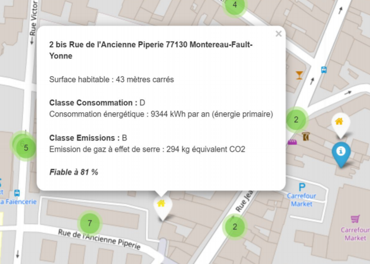
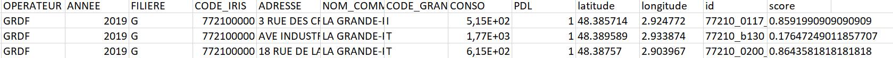

Une liste des technologies utilisées et, le cas échéant, des liens vers d’autres informations sur ces technologies.

## CARTE INTERACTIVE DE LA CONSOMMATION ENERGETIQUE DE LA COMMUNAUTE DE COMMUNES DE MONTEREAU.

### SOMMAIRE
#### I- Description et statut du projet
#### II- Installation et utilisation
#### III- Technologies utilisées
***
### I- Description et statut du projet.
***
Notre projet a eu pour but de traiter un grand nombre de données sur la consommation énergétiques de bâtiments partout en France, et de les visualiser de manière lisible à travers une carte de France intéractive. 

Sur cette carte, chaque point a été obtenu en géolocalisant les adresses contenues dans des fichiers issus des bases de données Diagnostic de Performance Energétique (DPE) et Données Locales de l'Energie (DLE) pour l'année 2019. 


Ces adresses correspondnt à des points de livraison de gaz ou électricité de bâtiments ou groupes de bâtiments dans les secteurs industriel, tertiaire ou résidentiel. En cliquant sur un point de la carte, on obtient alors la consommation énergétique en kWh/m² du bâtiment, ainsi que sa classe d'émissions de gaz à effets de serre. La légende indique également s'il s'agit d'un point de livraison de gaz ou d'électricité.

Le traitement des données à l'échelle de la France étant très long, nous nous sommes concentrés sur la Communauté de Communes de Montereau, qui contient déjà plusieurs milliers de points de livraison d'énergie. Un point d'amélioration serait de généraliser le traitement des données à l'ensemble du pays.

Voici un aperçu des informations affichées lorsque l'on clique sur la carte:


Nous avons choisi d'afficher ensuite cette carte sur une page html pour plus de lisibilité.
***
## II- Installation et utilisation
***
1) Prérequis

Il faut avoir installé la bibliothèque ````Folium```` ainsi que les modules ````request```` et ````multiprocessing````.

Une fois le dépôt cloné, il faut se placer dans le dossier ````PI_energie/code````.

2) Lancement

Une fois dans le dossier ```` code````, lancer les fichiers ````init_all.py```` et ````init_CCPM.py```` dans le terminal.
````
$ python init_all.py
$ python init_CCPM.py
````


Ces programment traitent les données du dossier data et en extrait les informations requises pour géocoder l'adresse du bâtiments. 

Ils renvoient finalement trois fichier ````.csv ````(deux issus du traitement des données DLE en gaz et électricité respectivement, et un issu du traitement des données DPE) qui contiennent notamment les coordonnées géographiques de chaque point de livraison, l'adresse exacte, leur consommation énergétique, ainsi qu'un score qui évalue la fiabilité du géocodage, et que l'on retrouve en cliquant sur un point de la carte.


***Apercu du tableau contenant les adresses géocodées.***

Ces fichiers sont nommés ````DLE-gaz-2019-CCPM-geocoded.csv, DLE-elec-2019-CCPM-geocoded.csv```` et 
````dpe_dle-pertinent.csv````
et sont stockés dans le dossier ````data````, avec le reste des données utilisées dans le traitement.

Toujours dans le dossier ````code````, lancer le fichier suivant:
````
$ python carte_vpyhton.py
````
Ce programme génère à partir des trois fichiers ````.csv```` une page HTML nommée ````carte_projet.html```` dans le dossier ````site```` sur laquelle est codée la carte avec tous les points de livraison.

3) Visualisation de la carte

Maintenant que la carte a été générée, il suffit d'ouvrir la page web ````site.html```` pour visualiser celle-ci avec les explications du projet et la légende.
***
## III- Technologies utilisées
***
Nous avons utilisé la bibliothèque Folium pour coder la carte.

Pour ce qui est du traitement des données, nous nous sommes aidés de l'API Adresse de la Base Adresse Nationale (BAN) pour récupérer les coordonnées géographiques associées à l'adresse de chaque point de livraison. La démarche et les requêtes sont expliquées ici : 

https://geo.api.gouv.fr/adresse


